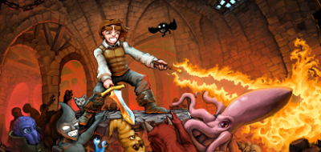
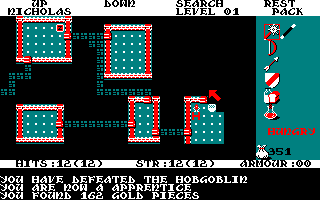
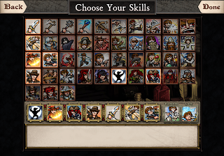
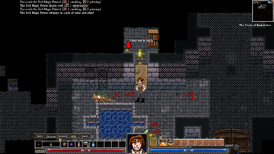
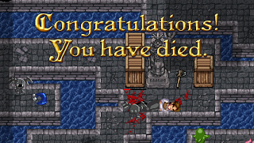

Hoy vamos a analizar Dungeons of Dredmor, un videojuego perteneciente a mi género favorito, los **roguelike**.  
  

<table align="center" cellpadding="0" cellspacing="0" class="tr-caption-container" style="margin-left: auto; margin-right: auto; text-align: center;"><tbody><tr><td style="text-align: center;"></td></tr><tr><td class="tr-caption" style="text-align: center;">¿Alguien ha notado la referencia a Doom?</td></tr></tbody></table>

  

### 

¿Qué diablos es un roguelike?

Básicamente es un tipo de juego en donde el movimiento es **por turnos** (nada se mueve hasta que tú lo haces) y transcurre en una mazmorra generada proceduralmente (se genera **al azar** y es diferente en cada partida), y en donde la misión del jugador consiste en descender hasta determinada profundidad y recoger un **objeto valioso** para luego escapar de la mazmorra. Para ello debe fortalecerse derrotando enemigos, explorando, recogiendo equipo, probando pociones y pergaminos (el efecto de cada color de poción suele cambiar en cada partida) y en general aprendiendo lás mecánicas. ¿Os suena a lo que véis en juegos modernos?  
  

<table align="center" cellpadding="0" cellspacing="0" class="tr-caption-container" style="margin-left: auto; margin-right: auto; text-align: left;"><tbody><tr><td style="text-align: center;"></td></tr><tr><td class="tr-caption" style="text-align: center;">El Rogue original de 1980 en versión Amstrad CPC</td></tr></tbody></table>

A conseguir el objetivo y escapar de una pieza se le llama "**Ascender**". La mayor parte de la gente no lo consigue nunca. ¡Ni jugando durante años!  
Lo normal es **morir** una y otra vez. A veces de forma injusta, otras por algún error cometido por el jugador, pero la muerte es una certeza en este tipo de juegos. Y es **permanente**. Si mueres, tendrás que comenzar de nuevo la partida.  
  
  

### 

¿Y qué tiene de especial Dungeons of Dredmor?

**Dungeons of Dredmor** es un juego roguelike bastante sencillo, accesible y con mucho sentido del humor. Las **referencias** a los videojuegos modernos como Deus Ex o Skyrim son constantes tanto en los comentarios de los enemigos como en el los nombres del equipamiento y las habilidades del jugador.

  

<table align="center" cellpadding="0" cellspacing="0" class="tr-caption-container" style="margin-left: auto; margin-right: auto; text-align: center;"><tbody><tr><td style="text-align: center;"></td></tr><tr><td class="tr-caption" style="text-align: center;">¿Quieres ser un Pirata-Arqueólogo con poderes mágicos? ¡Puedes!</td></tr></tbody></table>

Nuestro protagonista de grandes cejas debe bajar al décimo piso de la mazmorra en busca de **Lord Dredmor** y derrotarlo. En su camino encontrará una gran cantidad de **equipo** con multitud de bonificaciones de ataque y defensa, **pociones**, **hongos** y **licores** que aumentarán sus estadísticas temporalmente o le conferirán invisibilidad, resistencia elemental u otros efectos beneficiosos para el jugador (o no tanto). **Y quesos**. Muchos, muchísimos tipos de queso que recuperarán los puntos de vida del jugador.  
  

  

Podrás también utilizar los sistemas de **mecánica** y **alquimia** para crear nuevos objetos a partir de otros viejos.

  

También encontrarás **máquinas expendedoras** y **tiendas** en casi todos los pisos en donde podrás vender todo lo que encuentres o comprar equipo caro pero poderoso. Pero mejor no cabrees al tendero o acabarás reducido a cenizas.

  

Podrás atacar **cuerpo a cuerpo**, a **distancia** utilizando un arco o una ballesta, utilizar alguna de las numerosas **habilidades** que puedes escoger, invocar **hechizos**, utilizar varitas o tirar dardos, shurikens o incluso, ¡pelotas de béisbol!

  

<table align="center" cellpadding="0" cellspacing="0" class="tr-caption-container" style="margin-left: auto; margin-right: auto; text-align: center;"><tbody><tr><td style="text-align: center;"></td></tr><tr><td class="tr-caption" style="text-align: center;">Una interfaz ordenad y clara. ¡Así da gusto!</td></tr></tbody></table>

  

### 

¿Accesible y fácil?

**Dungeons of Dredmor** es accesible, posee una **interfaz clara** con iconos para realizar todas las acciones con un clic del ratón y abundante información al pasar el puntero por encima de cualquier elemento. Además el juego tiene unos gráficos **dibujados a mano** bastante simpáticos y con mucho encanto.

  

Tercia decir que por lo general los juegos de este género suelen representarse en modo texto, esto es, con números, letras y símbolos. Y de la interfaz, salvo excepciones, mejor ni hablar. Todas las acciones se llevan a cabo con combinaciones de teclas.

  

Pero que no te engañe, que **de fácil no tiene nada** en absoluto. Es un juego totalmente **hardcore**. El juego tiene un selector de dificultad, e incluso puedes desactivar la muerte permanente y reducir el tamaño de los mapas.

Pero **morirás**. Morirás todo el tiempo. Y te encantará hacerlo, porque es **divertido**.

Porque la muerte permanente es uno de los elementos que definen el género, y consigue que la sensación de **tensión** sea constante, por muchas veces que lo hayas jugado.

**Pensarás** concienzudamente todos y cada uno de tus movimientos... y temblarás de miedo cuando abras la puerta de un **zoo de monstruos** (un tipo de habitación llena de monstruos a rebosar).

  

Y si alguna vez llegas a ver a **Lord Dredmor**, es casi seguro que andarás escaso de objetos arrojadizos y pociones. ¡Corred, insensatos!

  

<table align="center" cellpadding="0" cellspacing="0" class="tr-caption-container" style="margin-left: auto; margin-right: auto; text-align: left;"><tbody><tr><td style="text-align: center;"></td></tr><tr><td class="tr-caption" style="text-align: center;">Éste es el mensaje que más verás en el juego</td></tr></tbody></table>

### No es oro todo lo que reluce

Dungeons of Dredmor no está libre de problemas. Cuando el juego salió era, simple y llanamente, **injugable** debido a la enorme cantidad de **bugs** presentes. Con el paso del tiempo han ido saliendo parches que han **solucionado** la mayor parte de los problemas de estabilidad, problemas de guardado, han cambiado el sistema de crafting, pulido el juego y añadido más habilidades al árbol... aún quedan bugs, pero los chicos de [Gaslamp Games](http://www.gaslampgames.com/) ofrecen un **servicio técnico excelente** en sus foros y actualizan con frecuencia.

  

Aún así las partidas pueden tardar siglos en cargar, y ni hablar de instalar mods a mitad de una partida, que o bien pasan cosas extrañas o bien la partida ni llega a cargar. Lo sé por experiencia porque me han pasado ambas cosas.

  

### Entonces, ¿vale la pena jugarlo?

**Absolutamente sí**, con bugs o sin ellos. Pero debes ser paciente y no debe importante morir una y otra vez. Si eres capaz de deshacerte de la mentalidad del jugador moderno de Call of Duty (en donde si mueres volverás a aparecer a escasos segundos del último punto de control), encontrarás un juego muy divertido que te absorberá durante **cientos de horas** sin que apenas te des cuenta.

  

Enlaces:

[Página web de Dungeons of Dredmor](http://www.dungeonsofdredmor.com/)  
[Página de Gaslamp Games](http://www.gaslampgames.com/)
