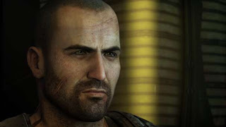
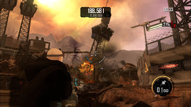

  

  
  
Hoy vamos a analizar Red Faction: Armageddon, el último juego que he terminado en su versión para PC. Es el único título de la saga al que he jugado desde que salió el primer Red Faction, allá por el año 2001. 
  
  

### Argumento con potencial

Manejaremos a **Darius Mason**, el nieto de **Alec Mason** (el protagonista de la anterior entrega, _Red Faction: Guerrilla_), considerado un héroe por la Red Faction de **Marte**.  
Ante un ataque liderado por el cultista **Adam Hale** con el objetivo de destruir el terraformador que controla el **clima de Marte**, se encomienda a las fuerzas militares de la Red Faction la tarea de impedirlo. Nuestro protagonista, Darius, que forma parte de dicho pelotón **mete la pata** hasta el fondo y termina con el terraformador destruido y el clima de Marte completamente fuera de control.  
  
Cinco años después, Darius es un **paria** que trabaja como mercenario junto a Kara, su amiga e interés amoroso. La sociedad de Marte se ha visto obligada a retirarse al interior del planeta para guarecerse del salvaje clima marciano.  
  
En una misión de excavación Adam Hale, a quien se creía muerto, **engaña** a Darius para abrir un misterioso sello y liberar a una antigua raza que habita en lo más profundo de Marte.  
  
La historia, que en principio promete, se va **desinflando** durante el transcurso del juego. El desarrollo de los personajes es nulo y la historia sólo se narra a través de escenas de vídeo al principio y al final de cada misión. Las conversaciones por radio apenas aportan algo más que la localización del siguiente objetivo, y el MCS (Módulo de Conciencia Situacional), un ordenador que hace las veces de Cortana en Halo intenta poner un contrapunto gracioso sin conseguirlo del todo.  
  
Lo peor de todo es la sensación de que tanto la historia como los personajes podrían haber **dado mucho más de sí**. Pero como no todo es malo en este juego, vayamos al siguiente apartado.  
  

<table align="center" cellpadding="0" cellspacing="0" class="tr-caption-container" style="margin-left: auto; margin-right: auto; text-align: center;"><tbody><tr><td style="text-align: center;"></td></tr><tr><td class="tr-caption" style="text-align: center;">No insistas, mi nombre no es Shepard</td></tr></tbody></table>

  
  

### Armas de destrucción masiva

Que quede algo claro: el juego es **divertido** a rabiar. Aunque se nota la influencia de Gears of War y la perspectiva es en **tercera persona**, no hay sistema de cobertura. El juego es completamente **lineal**, aunque existe un gran número de **vehículos** que Darius podrá pilotar y añadirán un extra de variedad. Pero lo que realmente destaca en _Red Faction: Armageddon_ es la **destrucción** del entorno y el uso de la **Nanoforja**.

  

Con **destrucción** del entorno nos referimos a que prácticamente **TODOS** los elementos contenidos en el mapa (edificios, torres, puentes) son destructibles. Ello nos permite poder acabar con los enemigos derrumbando sobre ellos parte del escenario, demoliendo los edificios donde se aposten o derribando los puentes sobre los que pasen.

  

Con la **Nanoforja** podremos **reconstruir** todo lo que hayamos destruido, lo que abre un amplio abanico de **posibilidades tácticas**.

  

A pesar de la linealidad, los escenarios son lo suficientemente **amplios** como para permitir abordar algunas secciones por más de un camino. Ello permite enfrentarse a las situaciones de distintas maneras.

  

El juego cuenta también con un **sistema de progresión** del personaje basado en la compra de habilidades, que una vez adquiridas se mantendrán también en el resto de modos de juego, lo que es sin duda un punto a su favor.  
  
En adición al modo campaña que tendrá una duración aproximada de **8 o 9 horas**, existen también otros modos de juego. En **Epidemia** deberás defenderte de las hordas enemigas  ya sea sólo o acompañado de otros jugadores. En el modo **Ruina** podrás recorrer los escenarios sin enemigos y con munición infinita para disfrutar una orgía de destrucción, con o sin límite de tiempo. Al terminar el juego desbloquearás el modo **Nuevo Juego Plus**, en donde conservarás las armas y las mejoras que hayas desbloqueado previamente.  
  

<table align="center" cellpadding="0" cellspacing="0" class="tr-caption-container" style="margin-left: auto; margin-right: auto; text-align: center;"><tbody><tr><td style="text-align: center;"></td></tr><tr><td class="tr-caption" style="text-align: center;">Destruirlo todo es una gozada</td></tr></tbody></table>

  

### Apartado técnico

El juego posee un apartado gráfico **notable** que a día de hoy sigue resultando atractivo, con unas texturas muy detalladas, una buena iluminación y efectos gráficos de última generación. Si las explosiones son fantásticas, más aún lo son las **físicas** de los edificios al derrumbarse gracias al uso del motor **Geo-Mod 2.5** que harán que los escombros salten por todas partes de manera realista.

  

Si algún pero se le puede poner es que la carga poligonal en los escenarios no parece ser muy elevada y que el diseño artístico resulta un poco **genérico**, provocando que elementos como los enemigos y los vehículos nos recuerden a los ya vistos en otros juegos. Además la optimización no es demasiado buena y causará algún bajón ocasional durante la acción a pesar de superar ampliamente los requisitos mínimos.

  

El doblaje está en inglés, aunque incorpora subtítulos en castellano. Es una gozada escuchar la orgía de gritos, explosiones y destrucción del juego en **Dolby Sorround 5.1**, aunque banda sonora pase desapercibida durante la mayor parte del juego.

  

**NOTA IMPORTANTE**: El juego parece salir aleatoriamente al escritorio en sistemas **Windows 7 de 64 bits**. No se sabe la causa, pero trasteando con las opciones gráficas el problema desaparece.

  

  

### Conclusión

Si para tí la diversión prima sobre el argumento, entonces hazte con él en alguna de las numerosas rebajas que hacen en tiendas como Amazon o Steam. Pero si esperas encontrar un título con la calidad de un triple A, tal vez deberías buscar en otra parte...
