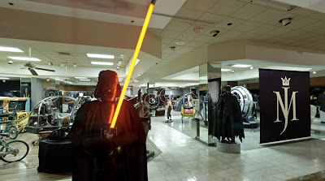

Es bien sabido por todos que **Michael Jackson** era un gran fan de los videojuegos y que poseía en su rancho de Neverland una grandiosa colección de máquinas arcade que haría las delicias de cualquier jugón que se precie. Minucias como una unidad **R360** de Sega, una máquina de **Dance Dance Revolution** o una cabinet deluxe de **Virtua Racing**. Casi nada...  
  

  
  
Lo que quizás no sepas es que puedes ver su colección en primera persona **[desde esta página](http://www.pinsane2.com/pinorama/events/MJ_09/kr/michael_jackson_arcade_entry.html).**  
  
Es de una exposición previa a la subasta de sus bienes en Beverly Hills, que al final el rey del pop pudo cancelar. ¿Quién no desearía poder estar ahí en persona?
