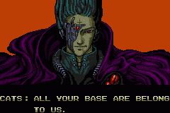

Los viejos clásicos nunca mueren. AYBABTU es un antiguo **meme** que proviene de una mala traducción de japonés a inglés (fenómeno conocido como _[engrish](http://www.engrish.com/)_) en la intro del juego [Zero Wing](http://es.wikipedia.org/wiki/Zero_Wing) para _Mega Drive_ en su versión europea.

Allá por el año 2000 apareció una **animación en flash** que reproducía la intro con voces y música tecno. Se extendió como la pólvora y "All You Base" tardó poco en convertirse en un **fenómeno cultural**. Dicha frase apareció en multitud de páginas web, videojuegos, software, películas, merchandising...

Aquí os dejo con el famoso vídeo:

<iframe src="//www.youtube.com/embed/8fvTxv46ano" width="420" height="315" frameborder="0" allowfullscreen="allowfullscreen"></iframe>

Puedes encontrar más información en [su artículo de la Wikipedia.](http://es.wikipedia.org/wiki/All_your_base_are_belong_to_us)
