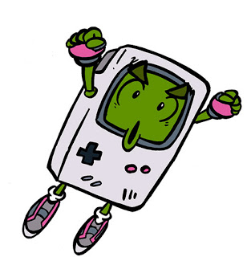

Si te gustan los juegos retro, no puedo dejar de recomendar que te pases por [GameBack TV](http://www.gamebacktv.com/), un _videopodcast_ que trata de juegos y sistemas antiguos, realizado con una gran profesionalidad.

Mención especial al primer episodio que trata en profundidad la historia de la [Game Boy](http://es.wikipedia.org/wiki/Game_Boy) y de su genio creador, [_Gunpei Yokoi_](http://es.wikipedia.org/wiki/Gunpei_Yokoi).

No dudes en pasarte [por su página](http://www.gamebacktv.com/) para ver los episodios disponibles.

