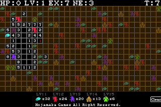

El juego recomendado del día es [Mamono Sweeper](http://www.hojamaka.com/game/mamono_sweeper/en.html), una versión del buscaminas de toda la vida... **con toques roleros.**

Se juega más o menos igual que el buscaminas normal, con la salvedad de que los números no indican la cantidad de minas que tienen alrededor, sino que indican la suma del nivel total de los monstruos que los rodean. Una casilla con 4 puede tener un sólo monstruo de nivel 4, o dos de nivel 2 a su alrededor...

El jugador comienza en nivel 1 y con 10 puntos de vida. A la hora de acabar con los enemigos hay que tener  en cuenta que harán un punto de daño por cada nivel en que superen al jugador. Si el jugador tiene nivel 2 y pincha en un monstruo de nivel 3, éste le restará un punto de vida.

**Una nueva vuelta de tuerca que hace más adictivo si cabe a uno de los juegos más conocidos.** [Versión fácil](http://www.hojamaka.com/game/mamono_sweeper_easy/en.html) | [Versión normal](http://www.hojamaka.com/game/mamono_sweeper/en.html) | [Versión difícil](http://www.hojamaka.com/game/mamono_sweeper_h/en.html) | [Versión extrema](http://www.hojamaka.com/game/mamono_sweeper_ex/) | [Versión ciega](http://www.hojamaka.com/game/mamono_sweeper_b/en.html)
