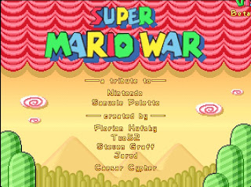
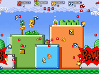
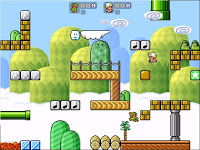

 

Me gustaría hacer una mención a un estupendo juego freeware que conozco desde hace mucho tiempo: **Super Mario War**.

Super Mario War es el resultado de mezclar el _Mario Bros_ clásico con _Unreal Tournament_.

Es un juego _multiplayer arena_ en el que entre uno y cuatro jugadores se enfrentarán todos contra todos o por equipos en una gran variedad de modos de juego, siendo éstos humanos o bots con mala leche.

Cuando digo variedad no bromeo: existen **22 modos de juego diferentes**, todos ellos con diversas variantes y modos de configuración. Vamos a hacer un pequeño repaso:

- _**Classic**_: El modo clásico. Se comienza con 10 vidas y gana el último hombre o equipo en pie.
- _**Frag Limit**_: Igual que el modo classic, pero con límite de muertes.
- _**Time Limit**_: Gana el jugador o equipo que más puntúe en un límite de tiempo.
- **_Jail_**: Como el modo Classic, pero con la diferencia de que aquellos jugadores que mueran acaban metidos en una jaula, reduciendo su velocidad y capacidad de salto. Podrán liberarse si acaban con otro jugador o consiguen una llave.
- **_Coin Collection_**: Aparecen monedas al azar por el escenario. Gana el jugador o equipo que más recoja hasta llegar a un límite de monedas preestablecido
- **_Stomp_**: Aparecen enemigos al azar por el escenario. Gana el jugador o equipo que más enemigos derrote hasta llegar al límite de frags.
- **_Yoshi's Eggs_**: En el mapa aparecerán varios Yoshis y varios huevos de distintos colores. Cada vez que alguien reúna un huevo con el Yoshi de su color correspondiente, sumará un punto. Gana el jugador o equipo antes llegue a una determinada puntuación.
- **_Capture the Flag_**: Otro modo clásico, gana el bando que más veces lleve a su base cualquier bandera enemiga.
- **_Chicken_**: El primero que haga un frag se convierte en el pollo, siendo el único que podrá aumentar su puntación. Aquel que acabe con él le robará el estatus de pollo. Obviamente todos los jugadores querrán acabar con el pollo.
- **_Tag_**: Cada jugador empieza con 200 puntos. Aquel que "la lleve" verá su puntuación reducida con el tiempo. Si el que la lleva toca a otro jugador, pasará a ser éste el que la "lleve". Gana el último jugador que conserve algún punto.
- **_Star_**: Hay tres variantes: Por defecto, un jugador al azar será el portador de la estrella negra. Podrá librarse si toca con la estrella a otro jugador. Cuando el contador de ronda llegue a cero, aquel que lleve la estrella negra morirá. En otra de sus variantes, existe una estrella blanca. Cuando el contador llegue a cero, sólo el portador de la estrella blanca sobrevivirá. En la última de las variantes siempre hay ua estrella blanca menos que el número de jugadores. Cuando el contador llegue a cero, el único jugador que no lleve una estrella morirá.
- _**Domination**_: Similar al modo de Unreal Tournament. Mantén el control de los puntos de dominación para aumentar tu puntuación.
- **_King of the Hill_**: El jugador que esté más tiempo en la zone de puntuaje ganará. Lógicamente la acción se concentra alrededor de la zona, que va cambiando de lugar con el tiempo.
- **_Race_**: Existen cuatro puntos de control que se mueven por la pantalla. Hay que tocarlos en orden para completar una "vuelta". Por supuesto, los otros jugadores intentarán obstaculizarte. Gana el jugador que antes llegue a la cantidad de vueltas establecida.
- **_Owned_**: Es parecido a Dominación, con la salvedad de que tus objetivos son los otros jugadores.  Cuando matas a otro jugador, éste reaparece rodeado por un orbe de tu color.  Los orbes generan puntos.  Si mueres, pierdes el dominio que hayas conseguido sobre otros jugadores.  Adicionalmente, si acabas con un jugador que ya esté bajo tu dominio sumarás cinco puntos.
- **Frenzy**: Similar al modo classic, pero además aparecen aleatoriamente por el escenario cartas con power-ups que los jugadores podrán recoger y utilizar.
- **_Survival_**: La pantalla se llena de todo tipo de peligros mortales. Gana el último jugador en pie.
- _**Greed**_: Los jugadores empiezan con una cantidad de monedas.  Cuando acabes con otro jugador, en lugar de morir perderán monedas, que saldrán despedidas en otras direcciones y los jugadores podrán recoger.  Cuando pierdas todas tus monedas quedarás eliminado de la partida.
- **_Health_**: Otro modo deathmatch, con la diferencia de que existen barras de energía representadas por corazones.  Si te aplasta, en lugar de morir perderás medio corazón.  No perderás ni tus armas ni tus items hasta que te quedes sin salud. Estate atento a los ítems con forma de corazón, porque aumentarán tu máximo de vida.
- **_Phanto_**: Otro modo VIP, pero con la mecánica de Super Mario Bros 2. Los jugadores obtendrán puntos mientras sean poseedores de la llave dorada, pero mientras la tengan se verán acosados por dos máscaras voladoras de Phanto y por el resto de jugadores que irán tras la llave.
- **_Shyguy Tag_**: Un modo VIP a la inversa. La puntuación de todos los jugadores aumentará mientras que no sean un Shyguy. El jugador que muera se convertirá en el Shyguy y su puntuación dejará de aumentar. Cuando todos se conviertan en Shyguys, recobrarán su estátus normal.
- **_Card Collection_:** Se trata de recolectar tríos de cartas.  Las cartas aparecen al azar por todo el mapa, aunque no puedes ver el tipo de carta hasta que las recojas.  Las cartas pueden tener dibujados una estrella, una seta o un corazón.  Cuando recojas tres cartas sumarás una vida, aunque si las tres cartas son del mismo tipo sumarás más vidas. Gana el primero que llegue a la puntuación máxima preestablecida.

 

La última versión corresponde a la 1.8 beta 2. Desgraciadamente tras [la muerte Florian Hufsky](http://en.wikipedia.org/wiki/Florian_Hufsky), su creador, el desarrollo se ha detenido aunque se habla de una reescritura del juego. Lo bueno es que el juego está portado a una gran variedad de plataformas: Windows, Linux, Mac, Xbox, Wii, PSP, Nintendo DS, Xbox 360, Playstation 2, GP2X, Dreamcast... ¡e incluso para Amiga!

Puedes descargarlo desde [su página](http://smw.supersanctuary.net/site/) o darte un paseo por [sus foros](http://72dpiarmy.supersanctuary.net/).
