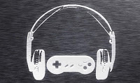

En esta entrega de las mejores canciones de videojuegos toca dar un repaso a los temas de batalla en los juegos de rol. Canciones que, por la cantidad de horas que terminamos escuchándolas acaban grabadas a fuego en nuestro cerebro. ¿Hay algún tema que eches de menos?  
**Lufia II - Boss Battle**  
**_Yasunori Shiono_**  

  
  
**Final Fantasy VIII - Don't Be Afraid**  
**_Nobuo Uematsu_**  

  
  
**Lunar Harmony of the Silver Star - Fighting Spirits**  
**_Noriyuki Iwadare_**  

  
  
**Lost Odissey - Fire Above the Battle**  
**_Nobuo Uematsu_**  

  
  
**Grandia 2 - FIGHT!! Ver. 1**  
**_Noriyuki Iwadare_**

  
  
**Final Fantasy VII - Still More Fighting**  
**_Nobuo Uematsu_**  

  
  
**Baten Kaitos - True Mirror**  
**_Motoi Sakuraba_**  

  
  
**Final Fantasy XIII - Blinded By Light**  
**_Nobuo Uematsu_**
