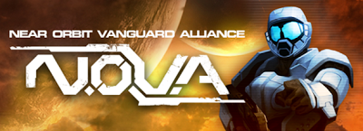
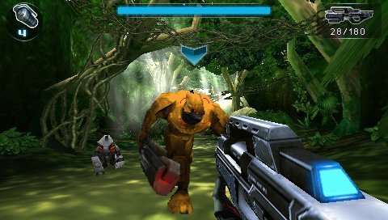

Acabo de terminarme el **NOVA**, que es básicamente un clon de [Halo](http://es.wikipedia.org/wiki/Halo) para PSP programado por la compañía [Gameloft](http://www.gameloft.es/). Los chicos de [Gameloft](http://www.gameloft.es/) son conocidos principalmente por dos cosas: sus juegos son copias desvergonzadas de otros títulos, y éstos siempre tienen unos gráficos despampanantes.

Antes de juzgar el aspecto gráfico del que hace gala **NOVA**, hay que tener en cuenta que es un juego para plataformas móviles portado a PSP. Los modelados son más bien simples, con una carga poligonal baja y unas texturas sencillas pero efectivas, aunque sí que puede presumir de tener una iluminación realmente lograda en algunos puntos. Otro problema es que el juego no está muy bien optimizado y corre a una tasa de imágenes por segundo más bien baja, pero al poco te acostumbras y se hace bastante jugable.

No pasará por un juego de PSP, pero tampoco hará sangrar tus ojos.

<table class="tr-caption-container" style="margin-left: auto; margin-right: auto; text-align: center;" cellspacing="0" cellpadding="0" align="center"><tbody><tr><td style="text-align: center;"></td></tr><tr><td class="tr-caption" style="text-align: center;">No me digas que no te recuerda a cierto juego de Microsoft...</td></tr></tbody></table>

Jugablemente toma prestados la mayor parte de elementos de cierta saga espacial de Microsoft: las armas, los escudos recargables, tu compañera IA dentro de tu cabeza, los enemigos, el aspecto gráfico de varios niveles y el ritmo de juego, que es una mezcla de enfrentamientos en entornos cerrados con escaramuzas en espacios más amplios.

Otro punto jugable a su favor es la transición en los controles de pantalla táctil a botones físicos: si bien en los móviles se hacía difícil de jugar, aquí te mueves con el stick analógico y apuntas con los botones de acción, dejando los gatillos y la cruceta digital para el resto de acciones. El apuntado automático resulta de bastante ayuda a la hora de tratar con los enemigos sin ser excesivo.

Si bien es una pena que los chicos de [Gameloft](http://www.gameloft.es/) no hayan trabajado más en el port, la historia sea casi inexistente y el multijugador haya desaparecido por completo (una oportunidad perdida), el juego me ha tenido enganchado un par de tardes y me ha dejado un buen sabor de boca. Recomendado.

**6/10**

Puedes encontrar más información en su **[página oficial.](http://www.near-orbit-vanguard-alliance.com/)**
