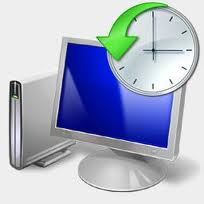
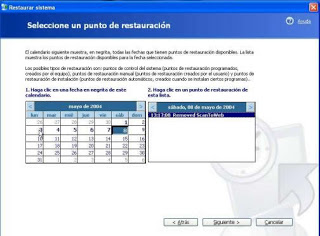

**Restaurar el Sistema** (_System Restore_ en inglés) es una utilidad presente en Windows desde la versión Millenium Edition. Es una de los mejores aliados para los técnicos informáticos a la hora de reparar un sistema desconfigurado.

¿Cómo funciona y qué utilidad tiene?

Básicamente consiste en que el sistema va haciendo copias de los programas y configuraciones que cambian con el uso, de tal manera que puedes dejar el ordenador tal y como estaba en una determinada fecha (eliminando incluso los virus que hubieran podido infectar tu ordenador desde entonces), pero respetando los documentos que hayas podido modificar.

Su uso es muy sencillo: para guardar los datos no tienes que hacer absolutamente nada: se hace automáticamente y viene activado por defecto en el sistema operativo. En cuanto a recuperar los datos, sólo tenemos que pulsar en el **Botón Inicio -> Todos los programas -> Accesorios -> Herramientas del sistema -> Restaurar sistema** y nos saldrá la siguiente ventana:

  

Tan sólo hay que escoger el último día y hora de entre los disponibles en los que el ordenador funcionara correctamente, pulsar **siguiente** un par de veces y  esperar a que el ordenador se reinicie. Cuando haya terminado de restaurar los archivos nos avisará y el ordenador quedará tal cual estaba el día elegido. ¡Y a seguir trabajando!

> _**Nota:** Algunas versiones piratas modificadas de Windows, como Windows UE, llevan Restaurar el Sistema desactivado por defecto. Aunque Restaurar el Sistema afecta ligeramente al redimiento, su utilidad supera ampliamente los contras de tenerlo activado._
