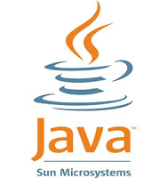
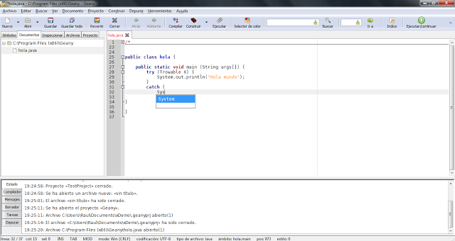
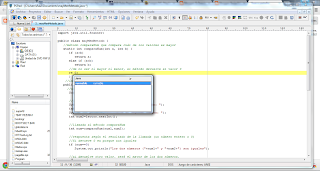
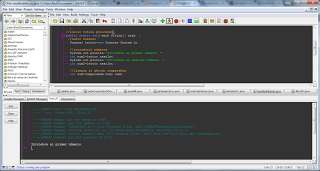

En el mundo del software libre podemos encontrar muchos **entornos de desarrollo integrados** gratuitos para cualquier lenguaje.

Si programas en Java probablemente conocerás los dos pesos pesados en cuanto a IDEs: [Eclipse](http://www.eclipse.org/) y [Netbeans](http://www.netbeans.org/). Por desgracia no sólo son pesados en cuanto a características, también lo son en cuanto al tamaño de la instalación y al consumo de recursos, lo que hace que no sean precisamente la mejor opción para llevártelos en un pendrive.

Así que me he embarcado en una aventura para buscar un editor ágil y funcional, que se adapte a mis necesidades y complemente el uso de mi entorno de desarrollo.

### [Geany](http://www.geany.org/)

La mejor opción para mí. Es un editor de código **ligero** (inicia en un par de segundos), es multiplataforma, soporta una gran cantidad de lenguajes de programación, autocompletado de código y dispone de una gran colección de plugins que le añaden nuevas funciones como depurador, corrector ortográfico o sistema de control de versiones.

Además, el compilado y la ejecución de clases de Java funciona directamente sin tener que configurar nada. El punto negativo es que las aplicaciones de consola se ejecutan fuera del programa, aunque sí que muestra en la consola los mensajes del compilador y el depurador.

### Otro que llevo a todas partes: [PSPad](http://www.pspad.com/es/)

PSPad es principalmente un editor de texto plano, pero cuenta también con funciones de edición de código. Cuenta con soporte de autocompletado en Java y gestión de proyectos, pero a la hora de compilar y ejecutar he tenido que trastear bastante con la configuración.

Aunque no la mejor opción para editar Java que existe, hay que decir en su favor que es el mejor editor de texto que he tenido ocasión de probar y también uno de los **mejores editores para HTML**, ya que no sólo autocompleta las etiquetas, sino que tiene un visor de HTML integrado, usa HTML Tidy para formatear el código, soporta snippets, hojas de estilo CSS, tiene un plugin para Zen Coding e incluso tiene un gestor de FTP. ¡Casi nada!

Lo he adoptado como editor de texto predeterminado.

### Mención honorable: [jGrasp](http://www.jgrasp.org/)

jGrasp es un editor de Java **programado en Java**. Es pequeño, ligero, tiene soporte para proyectos, ejecuta los programas desde dentro de su interfaz, tiene un depurador, genera automáticamente esquemas CSD y diagramas UML y además se integra con las herramientas JUnit, DCD, FindBugs, Checkstyle y Web-CAT.

Como aspectos negativos no soporta autocompletado, además de ser poco agradable a la vista y no servir más que para Java, pero... ¿Qué más da cuando ocupa tan poco?

Existen otras muchas alternativas aparte de éstas que pueden cubrir tus necesidades: [Programmer's Notepad](http://www.pnotepad.org/), [Notepad++](http://notepad-plus-plus.org/), [DrJava](http://drjava.sourceforge.net/), [Optistic IDX](http://www.optistic.com/index.php?id=8), [BlueJ](http://www.bluej.org/), [tIDE](http://tide.olympe.in/)...

¡Pruébalas todas y elige la que más te guste!
