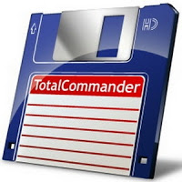
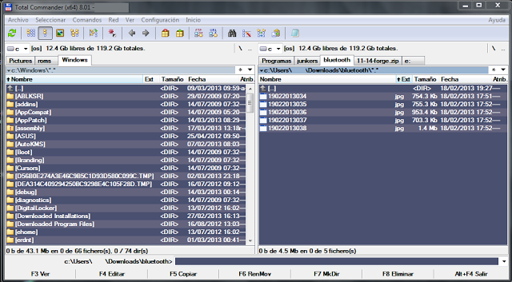
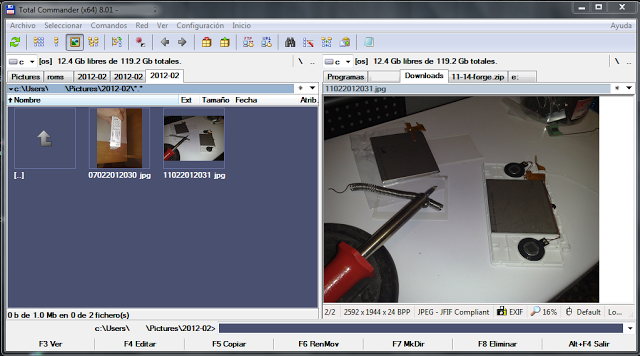

El explorador de Windows es una de las **herramientas básicas** que más usamos a diario para operar con archivos y carpetas. No obstante, a pesar de ser una herramienta fundamental ésta no ha evolucionado acorde con el resto de utilidades del sistema operativo.

Ahí es donde entra _[Total Commander](http://www.ghisler.com/)_, un gestor de archivos **alternativo** que cuenta con un enorme abanico de posibilidades que nos permitirán ser más productivos.

La última versión disponible es la 8.01, con versiones para 32 y 64 _bits_. En apenas poco más de los cinco _megabytes_ que ocupa el instalador nos encontramos con un programa que dispone de las siguientes opciones:

- Interfaz de doble ventana con soporte de pestañas
- Visor de archivos integrado
- Soporte interno para comprimir y descomprimir archivos comprimidos
- Panel de previsualización rápida
- Modo miniaturas
- Cliente _FTP_ integrado
- Herramientas para renombrar, unir y comparar archivos
- Acceso a la red local, conexión a unidades en red y conexión en paralelo
- Herramienta de búsqueda
- Soporte para codificar y decodificar archivos
- Creación y verificación de _Checksums_
- Filtros personalizados de selección y visualización
- Gestor propio de copia de archivos con posibilidad de poner las operaciones en cola

Por si aún no fueran suficientes las capacidades del programa pueden ampliarse con la instalación de _plugins_.¿Visor integrado de _PDF_? ¿Soporte para formatos de compresión adicionales? ¿Poder ver todo tipo de archivos en el visor de forma nativa? ¿Editor de código? ¿Visor de bases de datos? ¿Previsualizar archivos en formato _3DSMax_? ¿Navegar por otros sistemas de archivos? ¿Grabación integrada de _CD_? ¿Incluso recuperar archivos borrados?

 

<table class="tr-caption-container" style="margin-left: auto; margin-right: auto; text-align: center;" cellspacing="0" cellpadding="0" align="center"><tbody><tr><td style="text-align: center;"></td></tr><tr><td class="tr-caption" style="text-align: center;">No será muy bonito, pero cuando aprendas a usarlo no podrás vivir sin él</td></tr></tbody></table>

Todo eso y mucho más. Las posibilidades más locas que imagines pueden hacerse realidad gracias a la enorme cantidad de _plugins_ disponibles en la red. No en vano, la arquitectura de _plugins_ de _[Total Commander](http://www.ghisler.com/)_ es tan poderosa que gran parte de los gestores de archivos alternativos la usan también para poder aprovecharse de la compatibilidad con los _plugins_ de éste.

<table class="tr-caption-container" style="margin-left: auto; margin-right: auto; text-align: center;" cellspacing="0" cellpadding="0" align="center"><tbody><tr><td style="text-align: center;"></td></tr><tr><td class="tr-caption" style="text-align: center;">El panel de vista previa en acción</td></tr></tbody></table>

Aunque la interfaz del programa es un poco hosca, ya que está basada en el venerable _[Norton Commander](http://es.wikipedia.org/wiki/Norton_Commander)_, vale la pena tomarse el tiempo necesario para explorar todas las posibilidades que ofrece y aprender a usarlas con soltura.El programa cuesta **32€**, lo que a primera vista puede parecer caro. Hay que tener en cuenta que es el mejor programa de su clase y no existe ninguna alternativa que lo supere, gratuita o de pago. Además el autor pone a disposición del público una versión _[shareware](http://es.wikipedia.org/wiki/Shareware)_ sin caducidad y que cuenta con todas las funciones de la versión completa, para que lo pruebes durante el tiempo que consideres necesario.

**¿Te animas a probarlo?**

_[Sitio web de Total commander](http://www.ghisler.com/)_

_[Repositorio de plugins](http://www.totalcmd.net/)_
