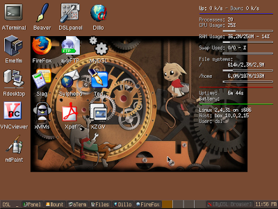
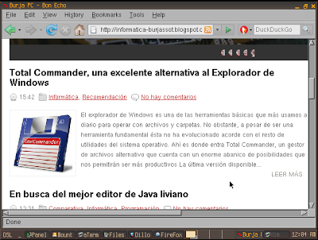
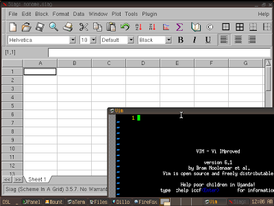
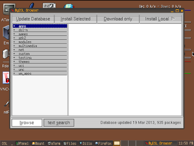

_[Damn Small Linux](http://www.damnsmalllinux.org/index_es.html)_ (_Linux_ condenadamente pequeño en español) es una distribución de _Linux_ basada en _[Knoppix](http://knoppix.net/)_ que nació a partir de un experimento: conseguir una distro funcional en tan sólo 50 megas.

<table class="tr-caption-container" style="margin-left: auto; margin-right: auto; text-align: center;" cellspacing="0" cellpadding="0" align="center"><tbody><tr><td style="text-align: center;"></td></tr><tr><td class="tr-caption" style="text-align: center;">¿Todo esto en 50 megas?</td></tr></tbody></table>

Sus requerimientos son **realmente humildes** teniendo en cuenta todo lo que podemos hacer con él: **Un procesador _486DX_ y _16MB_ de _RAM_**, pudiendo ejecutar el _Live CD_ completamente volcado a la _RAM_ si disponemos de _128MB_.

<table class="tr-caption-container" style="margin-left: auto; margin-right: auto; text-align: center;" cellspacing="0" cellpadding="0" align="center"><tbody><tr><td style="text-align: center;"></td></tr><tr><td class="tr-caption" style="text-align: center;">La detección de la red es automática. ¡Impresionante!</td></tr></tbody></table>

En cuanto a software, dispone del reproductor _XMMS_, cliente de _FTP_, navegadores _Dillo, Netrik_ y _Firefox_, hoja de cálculo _Siag_, el cliente de correo _Sylpheed_, soporte para comprobación ortográfica (en inglés), el procesador de textos _TED_, los editores _Beaver, Vim_ y _Nano_, _Xpaint_ y _xzgv_ para visualizar y editar gráficos, visor de archivos pdf _Xpdf_, el estupendo gestor de archivos _emelFM_, el cliente de mensajería instantánea multiprotocolo _Naim_, visor _VNCviewer_, _Rdesktop_, cliente y servidor _SSH/SCP_, cliente _DHCP, PPP, PPPoE_, servidor web, calculadora, soporte para impresoras, _NFS_, gestores de ventanas _Fluxbox_ y _JWM_, juegos, aplicaciones de monitorización del sistema, utilidades de línea de comandos, soporte _USB_ y _PCMCIA_, y finalmente soporte para algunas tarjetas _Wireless_.

 

<table class="tr-caption-container" style="margin-left: auto; margin-right: auto; text-align: center;" cellspacing="0" cellpadding="0" align="center"><tbody><tr><td style="text-align: center;"></td></tr><tr><td class="tr-caption" style="text-align: center;">No faltarán editores, entre ellos el conocido Vim</td></tr></tbody></table>

Por si no fuera bastante, si disponemos de conexión a la red podemos instalar programas adicionales en la memoria con el gestor gráfico de paquetes _myDSL_, que clasifica los programas por categorías: _Gimp_, _OpenOffice_, _Dosbox_, _AbiWord_, _Ghostview_... todo a un sólo clic de ratón.

 

<table class="tr-caption-container" style="margin-left: auto; margin-right: auto; text-align: center;" cellspacing="0" cellpadding="0" align="center"><tbody><tr><td style="text-align: center;"></td></tr><tr><td class="tr-caption" style="text-align: center;">El gestor de paquetes myDSL</td></tr></tbody></table>

Como curiosidad, _DSL_ es una de las pocas distribuciones que han sido [adaptadas](http://sourceforge.net/projects/xbox-linux/files/X-DSL/) para funcionar en la vieja _[**X-Box**](http://es.wikipedia.org/wiki/Xbox)_ (que contaba con _64MB_ de _RAM_) y funcionaba además con soltura. Con el paquete _DosBox Wine_ instalado un servidor ha llegado incluso a jugar a _**Unreal Tournament**_ en la consola de _[Microsoft](http://www.microsoft.es/)_... ¡Y con fluidez!

_DSL_ es una distribución _imprescindible_ para llevar en un _pendrive_ o _CD multiboot_, ya que sólo ocupa 50 _megas_ y arranca en segundos allá donde un _Ubuntu Live_ arrancaría en minutos, como por ejemplo ordenadores antiguos o netbooks. Ofreciendo tanto en tan poco espacio, ¿a qué esperas para descargarlo?

[Sitio web de DSL](http://www.damnsmalllinux.org/index_es.html)
