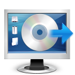
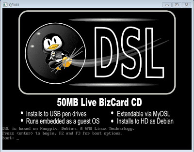
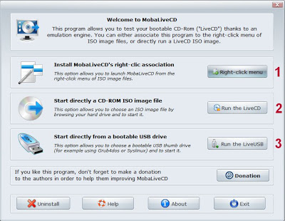

 Cada día el uso de los [_Live CD_](https://es.wikipedia.org/wiki/Live_CD) es más común, bien sea para trastear, bien para rescatar un equipo con problemas o para necesidades más específicas.

Sin embargo, dada la gran variedad de distribuciones de _[Linux](http://es.wikipedia.org/wiki/GNU/Linux)_ que podemos encontrar en la red en formato _ISO_, grabarlas en _CD_ puede llegar a tener un gran costo en tiempo y en consumibles.

Existe la alternativa de grabarlas en un _pendrive_ o tarjera de memoria y arrancar el ordenador desde ellas, pero es un proceso complicado para el usuario medio.

 

Lo más probable es que ya conozcas software de virtualización como _[VirtualBox](https://www.virtualbox.org/)_ o _[VMware Player](http://www.vmware.com/products/player/)_, que básicamente son emuladores de _PC_. Son rápidos, tienen asistentes de configuración y cuentas con actualizaciones constantes, sin embargo no siempre son la solución idónea. Sus instalaciones ocupan centenares de _megabytes_ e instalan nuevos controladores en tu sistema, lo que puede no ser del gusto de un usuario que tan sólo quiera probar una distribución.

Existen también proyectos de [Software Libre](http://es.wikipedia.org/wiki/Software_libre) como _Bochs_ o _Qemu_ que, si bien son más livianos y no necesitan instalación, son más complicados de utilizar y exigen un perfil de usuario más avanzado.

Ahí es donde entra _MobaLiveCD_, una solución basada en _Qemu_ que permite emular imágenes con un sólo clic del ratón y cuya existencia agradecerán enormemente los usuarios de a pie.

El funcionamiento de _MobaLiveCD_ es muy sencillo: al hacer doble clic sobre el ejecutable se abre un menú con las siguientes opciones:

1. _Instalar una entrada en el menú al hacer clic derecho en una iso_
2. _Arrancar directamente una iso_
3. _Arrancar desde un pendrive autoarrancable_

La primera opción hace que al hacer clic derecho en una imagen iso nos aparecerá la opción de ejecutarla directamente con _MobaLiveCD_, la segunda nos permite escoger la localización de la iso y por último, la tercera opción nos da a elegir una unidad que usaremos para arrancar el emulador.

Una vez escogida la iso a emular nos preguntará si queremos crear un disco duro virtual. Si sólo queremos probar un _Live CD_ diremos que no, ya que están diseñados para funcionar sin disco duro y por tanto no es necesario. ¡Y eso es todo!

Es importante recordar que para poder sacar el ratón de la ventana del programa tendremos que pulsar la combinación de teclas _control + alt._

El rendimiento de _Qemu_ puede ser menor que el de las opciones profesioneales, pero es más que suficiente para ejecutar un _Live CD_ y su facilidad de uso es, sencillamente, imbatible. Y todo en un único ejecutable que ocupa 1,6 _megabytes_, perfecto para llevarlo siempre a todas partes en un _pendrive_.

**Enlace a la página web de MobaLiveCD:** [http://mobalivecd.mobatek.net/en/](http://mobalivecd.mobatek.net/en/)
