### ¿Qué es un homebrew?

Un _homebrew_ es una aplicación no oficial programada por aficionados para una determinada plataforma y que suele ser gratuita.

La vetusta _Gameboy Advance_ experimentó durante su vida comercial (y tras ella) una gran actividad en la escena _homebrew_ que dio lugar a una gran cantidad de emuladores, juegos, ports y remakes.

**¡Repasemos algunos de los mejores!**

### [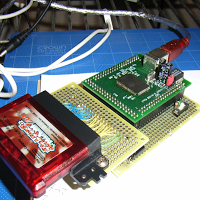](http://1.bp.blogspot.com/-Cbz2EJX4KSQ/UhpoTuTg0PI/AAAAAAAAEnM/IzDJx-alCk0/s1600/homebrew.png)

### Talisman

El conocido juego de tablero de Games Workshop cuenta con una estupenda adaptación en GBA de la mano de [My Wife Rocks Productions](http://www.mywiferocksproductions.com/). A diferencia de la reciente [versión oficial](http://www.talisman-game.com/) para PC, permite jugar una partida completa contra hasta tres oponentes controlados por IA.

_A pesar de que la gente de Games Workshop obligó a los autores retirar la rom de su página, todavía puede encontrarse a través de tu [buscador favorito](https://www.google.es/search?q=talisman+gba+rom&oq=talisman+gba+rom)._

[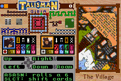](http://pixelotes.com/wp-content/uploads/2013/08/project_talisman2.png)

 

### Gleam

Gleam es un clon de [**Lumines**](http://www.ubi.com/ES/Games/Info.aspx?pId=10447), el conocido puzzle del diseñador [Tetsuya Mizuguchi](http://en.wikipedia.org/wiki/Tetsuya_Mizuguchi). Teniendo en cuenta que es un título casero sorprende lo pulido que está tanto en el apartado gráfico como en el sonoro. Ver para creer.

_Descárgalo [aquí](http://pdroms.de/files/gameboyadvance/gleam)._

[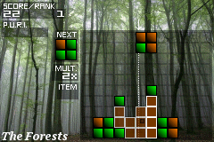](http://pixelotes.com/wp-content/uploads/2013/08/gleam.png)

 

### EliteAGB

La obra maestra de Ian Bell y [David Braven](http://en.wikipedia.org/wiki/David_Braben) en la que explorarás la galaxia en busca de fama y fortuna con total libertad: conviértete en pirata, cazarrecompensas o mercader.

Además de tener algunas mejoras con respecto al original (está basado en [Elite-A](http://wiki.alioth.net/index.php/Elite-A)) el sistema de control sustituye las combinaciones de teclas por un sistema de menús gráfico muy sencillo de utilizar.

_El autor del remake tuvo que retirar la descarga a petición del creador original. Todavía puedes encontrar la rom [si buscas en Google](https://www.google.es/search?q=elite+agb&oq=elite+agb)._

[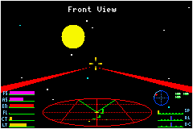](http://pixelotes.com/wp-content/uploads/2013/08/EliteAGB.png)

 

### Another World

La obra más conocida de [Éric Chahi](http://es.wikipedia.org/wiki/%C3%89ric_Chahi) versionada para la portátil de Nintendo.

Fue un juego innovador en muchos aspectos: unos estupendos gráficos vectoriales, unas cinemáticas espectaculares y una total ausencia de marcadores en pantalla, entre otros.

Comprueba por ti mismo por qué se considera como uno de los clásicos de la historia de los videojuegos.

_Descárgalo [aquí](http://pdroms.de/files/gameboyadvance/another-world-gba-v2-1)._

[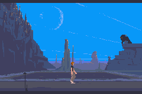](http://pixelotes.com/wp-content/uploads/2013/08/Another_world.png)

 

### T2002

Un remake de Turrican para GBA que incluye gráficos y música del original de Amiga. En su [página web](http://www.pekaro.de/) existe también una versión para Windows y un editor de niveles.

_Descárgalo [aquí](http://www.pekaro.de/t2002.html)._

[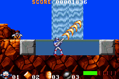](http://pixelotes.com/wp-content/uploads/2013/08/T2002GBA.png)

 

### Vulkanon / BulletGBA

Son dos matamarcianos del subgénero bullet hell programados por el mismo [autor](http://pqrs.org/) que pondrán a prueba tu pericia a los mandos.

En ambos tendrás que esquivar una constante lluvia de balas por parte de los enemigos, contando con el tamaño y la velocidad de tu nave como únicos aliados.

La principal diferencia entre ambos es la orientación de pantalla, horizontal en BulletGBA y vertical en Vulkanon. Este último cuenta también con un modo de entrenamiento en el que podemos elegir diferentes patrones de proyectiles.

_Descárgalos [aquí](https://pqrs.org/index.html.en)._

[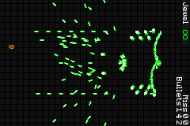](http://pixelotes.com/wp-content/uploads/2013/08/bulletgba.png)

 

### Chip Advance

Es una versión de [Chip's Challenge](http://en.wikipedia.org/wiki/Chip%27s_Challenge), un antiguo juego de puzzle desarrollado por [Epyx](http://en.wikipedia.org/wiki/Epyx) en 1989 para la Atari Lynx y portado después a multitud de sistemas. En él controlamos a Chip en una serie de pantallas en las que deberemos recoger llaves, potenciadores y chips en el orden correcto para poder completarlas sin quedarnos atascados.

_Descárgalo [aquí](http://pdroms.de/files/gameboyadvance/chip-advance-v2-1)._

[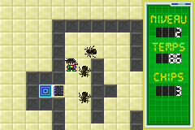](http://pixelotes.com/wp-content/uploads/2013/08/chipadvance.png)

 

### Castle Master

Un juego recordado por sus sorprendentes gráficos 3D en el momento de su salida gracias a su motor Freescape y ahora portado por Quirky para GBA. Es una aventura gráfica en primera persona en la que nos adentraremos en el Castillo de la Eternidad en busca de nuestra pareja, que ha sido raptada por un dragón.

_Descárgalo [aquí](https://sites.google.com/site/gbaremakes/home/games/castlemaster)._

[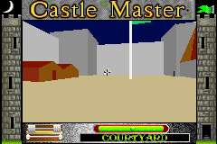](http://pixelotes.com/wp-content/uploads/2013/08/castle.png)

 

### POWDER

Powder es el único _roguelike_ específicamente programado para GBA, aunque posteriormente se ha _portado_ a otros sistemas.

Es agradable a la vista, fácil de manejar y con unas mecánicas bastante diferenciadas de Rogue/Hack.

Mantener contentos a los dioses tiene una gran influencia sobre la partida y comer los cadáveres de los enemigos te otorgará distintas bonificaciones.

_Descárgalo [aquí](http://www.zincland.com/powder/?pagename=about)._

[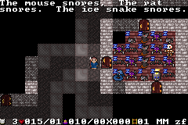](http://pixelotes.com/wp-content/uploads/2013/08/powder117.png)

 

### AGB Rogue

¿Quieres jugar al juego que dio nombre a todo un género? Este port cuenta con el tileset de la versión amiga, la opción de jugar en ASCII, teclado virtual y minimapa. El menú está muy bien organizado. Primero se debe escoger la acción a realizar y después el objeto al que aplicarla.

_Descárgalo [aquí](http://www.freewebs.com/drussell/)._

[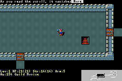](http://pixelotes.com/wp-content/uploads/2013/08/AGB_Rogue.png)

 

### AGB Hack

Hack es un clon de Rogue con más muchas más posibilidades, como un bestiario expandido, la existencia de tiendas en la mazmorra o la posibilidad de escoger el género y la profesión de nuestro personaje. . Este port cuenta con el _tileset_ de la versión Amiga, la opción de jugar en ASCII, un teclado virtual y un minimapa. Pulsando _start_ aparece un menú con el inventario y las acciones disponibles, y el hecho de que pulsando el botón de acción en un objeto aparezcan las acciones contextualmente lo hace mucho más fácil de manejar que AGB Rogue.

_Descárgalo [aquí](http://www.freewebs.com/drussell/)._

[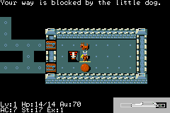](http://pixelotes.com/wp-content/uploads/2013/08/AGB_Hack.png)

 

### GBA Rogue

Si bien de los dos ports de Rogue existentes éste es el menos agraciado gráficamente, también es el más fácil de jugar de los dos. Al igual que hizo con el port de Elite, Quirky ha introducido un sistema gráfico de menús para acceder a las funciones más importantes del juego. Cuenta también con un teclado virtual para acceder al resto de comandos.

[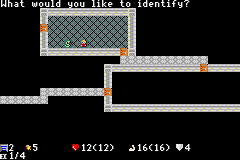](http://pixelotes.com/wp-content/uploads/2013/08/gbarogue-1.0.png)

_Descárgalo [aquí](https://sites.google.com/site/gbaremakes/home/games/rogue)._
