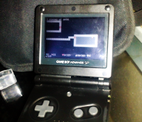
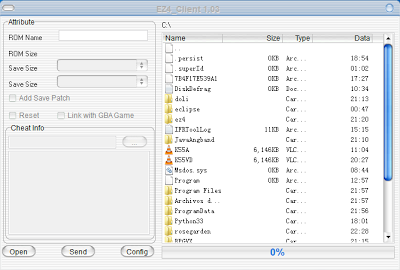
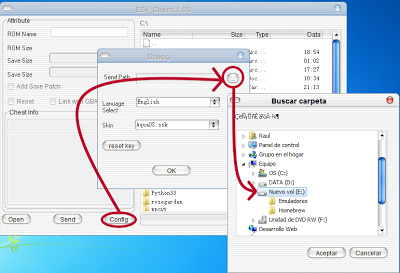
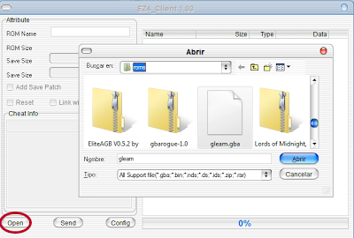
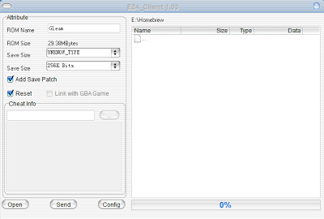
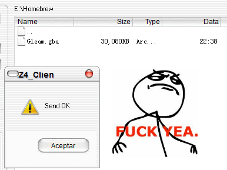

Aprovechando que en el [último articulo](http://pixelotes.com/uncategorized/aplicaciones-homebrew-para-gba-parte-i/) repasamos algunos de los mejores homebrews de Gameboy Advance he preparado una pequeña guía sobre el manejo del _flashcart_ **EZ-Flash IV**, que es el que yo uso.

_**Un flashcart es un cartucho con capacidad para cargar el software que copiemos en su memoria, siempre que esté diseñado para ser ejecutado en la consola.**_

Los _homebrew_ vienen en forma de archivos con extensión _.gba_ que tendremos que **copiar** a la tarjeta _mini-sd_ que el _flashcart_ usa como almacenamiento.

En la mayor parte de los casos **no bastará** con copiar los archivos a la tarjeta, sino que tendremos que parchearlos antes para asegurarnos de que la partida se guardará correctamente.

Para ello usaremos el programa que podemos encontrar en [la página de su fabricante](http://www.ezflash.cn/software.htm), el **EZIV-Client**.

La primera vez que lo ejecutemos nos dará a escoger entre chino e inglés. Suponiendo que escojamos el inglés nos encontraremos con esta pantalla:

Lo primero que tenemos que hacer es indicarle al programa dónde se encuentra la tarjeta de memoria. Para ello haremos clic en el botón _**Config**_ y escogemos la unidad de la _mini-sd_, que en mi caso es E:

Lo siguiente es cargar el _homebrew_ en la aplicación. Hacemos clic en _Open_, localizamos el fichero y le damos a _Abrir_.

Si el campo _**ROM Name**_ aparecerá vacío la mayor parte de las veces. No pasa nada, le ponemos un nombre nosotros mismos, dejamos las opciones de guardado como vienen y marcamos la casilla _**Add Save Patch.**_

Hacemos clic en **_Send_** para que el archivo modificado se copie en la tarjeta, repetimos el proceso en caso de que querer añadir algún juego más y ya por último introducimos la _mini-sd_ de nuevo en el _flashcart_, encendemos la consola... **¡y a jugar!**

