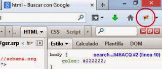
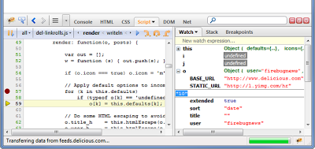

[Firebug](https://addons.mozilla.org/es/firefox/addon/firebug/) es un _addon_ para el navegador Mozilla Firefox que añade una serie de características adicionales dirigidas a los profesionales en el desarrollo de páginas web o a aquellos usuarios que quieran trastear con el código de un documento _html_.

Una vez instalado el añadido aparecerá el icono de un pequeño escarabajo al lado de la barra de búsqueda. Si hacemos clic en él con una página ya cargada aparecerá una nueva ventana en la parte inferior del navegador (aunque la posición puede cambiarse) similar a las opciones de desarrollador web que del navegador pero más completa.

Desde las pestañas podremos ver el código del documento, las hojas de estilo cargadas, la estructura del documento, los recursos... funciones que pueden ampliarse con la gran cantidad de **añadidos** que pueden encontrarse para este plugin [aquí](https://getfirebug.com/wiki/index.php/Firebug_Extensions) como soporte para autocompletado de código, visor de árboles DOM, soporte para SASS y mucho más.

Sin duda alguna la característica más cónocida y utilizada es la posibilidad de hacer cambios en las hojas de estilo .css y **ver los cambios en que hacemos en tiempo real**, una característica que sólo está disponible en algunos editores profesionales de pago.

Si estás interesado en el diseño web no dudes en probarlo. \[ [Enlace a la página oficial de Firebug](https://getfirebug.com/) \]
