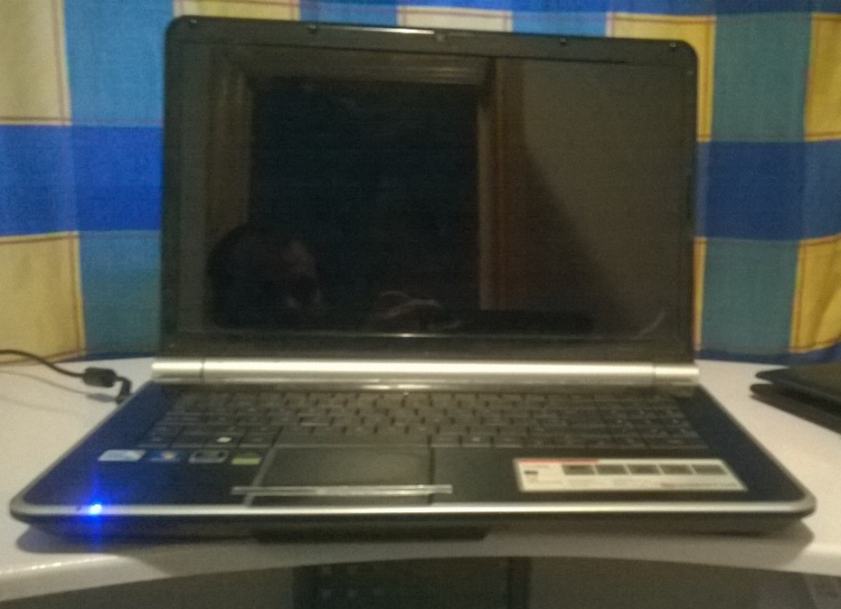
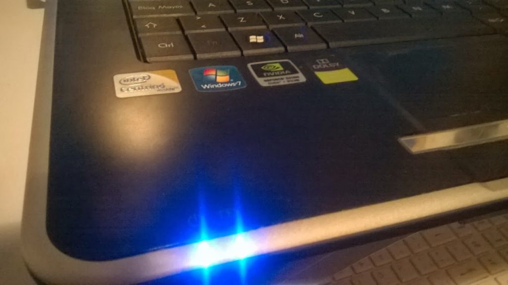
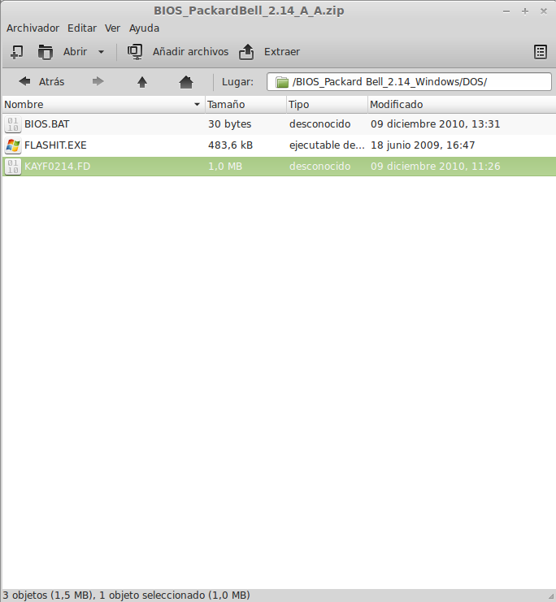
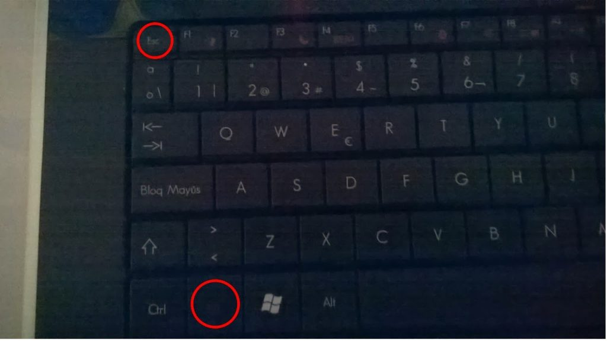
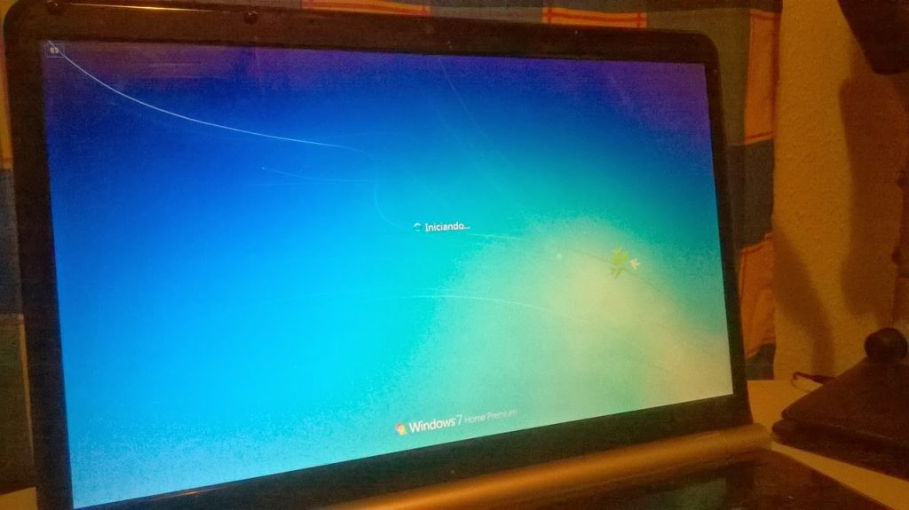

Hoy tocaba reparar un portátil **Packard Bell Easynote LJ67**, un equipo con algo de tiempo a sus espaldas pero con una magnífica pantalla de 17.3".

<table class="tr-caption-container" style="margin-left: auto; margin-right: auto; text-align: center;" cellspacing="0" cellpadding="0" align="center"><tbody><tr><td style="text-align: center;"></td></tr><tr><td class="tr-caption" style="text-align: center;">It's a me, Mario!</td></tr></tbody></table>

El problema que indicaba su propietario es que **no llegaba a arrancar** y **no aparecía nada** en la pantalla. ¿Cuál era pues el problema?

Al tratar de encender el equipo (el botón de encendido se ubica en la bisagra derecha) se encendían los ventiladores, pero no llegaba a emitir ningún pitido de error y el disco duro no se movía. **Mala cosa.**

<table class="tr-caption-container" style="margin-left: auto; margin-right: auto; text-align: center;" cellspacing="0" cellpadding="0" align="center"><tbody><tr><td style="text-align: center;"></td></tr><tr><td class="tr-caption" style="text-align: center;">Los LEDs se encienden, pero nada más.</td></tr></tbody></table>

Lo primero que pensé es que se trataba de un problema de la placa base, ya que no es la primera vez que he visto síntomas parecidos. Pero, antes de ponerme a desmontar, no costaba nada probar a **actualizar** la [_BIOS_](http://es.wikipedia.org/wiki/BIOS).

Los equipos de esta gama tienen un **modo de recuperación** llamado **CRISIS**, que se activa con una combinación de teclas en el encendido y en donde automáticamente se actualiza la [_BIOS_](http://es.wikipedia.org/wiki/BIOS) desde un [_pendrive_](http://es.wikipedia.org/wiki/Memoria_USB) insertado en cualquier puerto [_USB_](http://es.wikipedia.org/wiki/Universal_Serial_Bus).

Dicho [_pendrive_](http://es.wikipedia.org/wiki/Memoria_USB) debe tener un sistema de archivos [_FAT16_](http://es.wikipedia.org/wiki/Tabla_de_asignaci%C3%B3n_de_archivos) o [_FAT32_](http://es.wikipedia.org/wiki/Tabla_de_asignaci%C3%B3n_de_archivos) y **no es necesario formatearlo** ni borrar su contenido, ya que el proceso no realiza ninguna escritura en la unidad. En mi caso usé un [_pendrive_](http://es.wikipedia.org/wiki/Memoria_USB) de 2Gb que contenía una copia de [Linux Mint 16](http://www.linuxmint.com/).

Lo primero es descargar la **última actualización** de la [_BIOS_](http://es.wikipedia.org/wiki/BIOS) para este modelo desde [aquí](http://www.packardbell.es/pb/es/ES/content/download) (hacemos una búsqueda por modelo). Descomprimimos el archivo descargado y copiamos el archivo _KAYF0214.fd_ al directorio raíz del [_pendrive_](http://es.wikipedia.org/wiki/Memoria_USB). Después cambiamos el nombre de la bios a _KAYF0X64.fd_ (**importante**).

<table class="tr-caption-container" style="margin-left: auto; margin-right: auto; text-align: center;" cellspacing="0" cellpadding="0" align="center"><tbody><tr><td style="text-align: center;"></td></tr><tr><td class="tr-caption" style="text-align: center;">La BIOS se encuentra dentro de la carpeta DOS.</td></tr></tbody></table>

Con el [_pendrive_](http://es.wikipedia.org/wiki/Memoria_USB) insertado arrancamos el equipo mientras **mantenemos pulsados** los botones _Función (Fn)_ y _Escape (Esc)_. Es posible que en otros modelos la combinación de teclas pueda variar.

<table class="tr-caption-container" style="margin-left: auto; margin-right: auto; text-align: center;" cellspacing="0" cellpadding="0" align="center"><tbody><tr><td style="text-align: center;"></td></tr><tr><td class="tr-caption" style="text-align: center;">La combinación de teclas a pulsar mientras encendemos</td></tr></tbody></table>

La pantalla seguirá en negro, pero es algo normal. Comenzará a leer del [_pendrive_](http://es.wikipedia.org/wiki/Memoria_USB) y al terminar el proceso, que tardará un par de minutos, se reiniciará automáticamente con la [_BIOS_](http://es.wikipedia.org/wiki/BIOS) actualizada.

**¡Y voilá!** En este caso el problema era que la [_BIOS_](http://es.wikipedia.org/wiki/BIOS) estaba corrupta y el equipo resucitó sin tener que quitar ni un solo tornillo.

**Este post apareció originalmente en el blog de [BurjaPC](http://www.burjapc.com/)**
