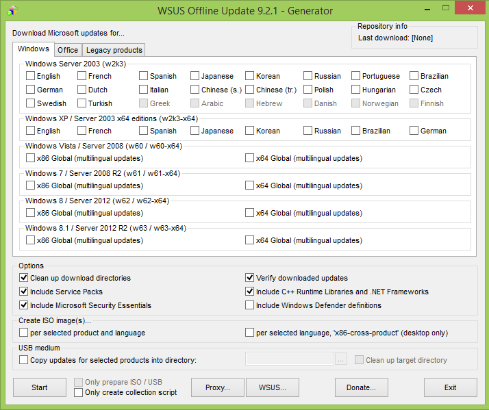
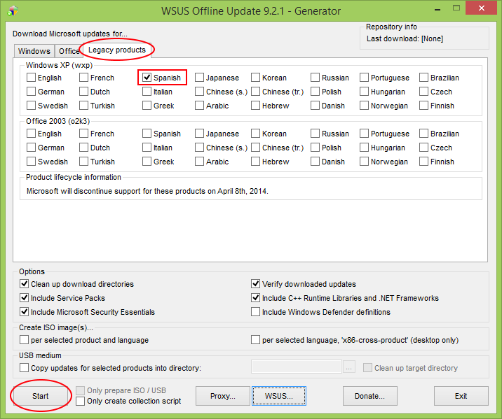
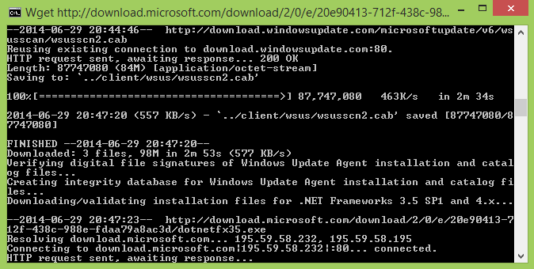
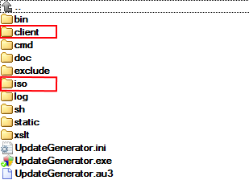

 

**_WSUS Offline Update_** es una utilidad creada por _Torsten Wittrock_ que sirve para crear un _**Service Pack**_ personalizado con todas las actualizaciones acumuladas existentes para cualquier [Sistema Operativo](http://es.wikipedia.org/wiki/Sistema_operativo) de [_Microsoft_](http://www.microsoft.com/es-es/default.aspx), con el consiguiente **ahorro** de ancho de banda y tiempo que supone la instalación automatizada de las actualizaciones **especialmente en equipos con el Sistema Operativo recién instalado**.

La versión 9.2.1 (la más actualizada en el momento de escribir este artículo es la 9.3.1) es la **última** en soportar la descarga de actualizaciones para _Windows XP_, ya que _Microsoft_ [dejó de darle soporte](http://www.microsoft.com/es-es/windows/endofsupport.aspx) el pasado mes de Abril.

<table class="tr-caption-container" style="margin-left: auto; margin-right: auto; text-align: center;" cellspacing="0" cellpadding="0" align="center"><tbody><tr><td style="text-align: center;"></td></tr><tr><td class="tr-caption" style="text-align: center;">Vista inicial de la aplicación.</td></tr></tbody></table>

 

Como puede verse, la interfaz es bastante sencilla. La versión _XP_ de 32 _bits_, que es la que se encuentra de manera más habitual, se esconde dentro de la tercera pestaña (_Legacy products_).

 

<table class="tr-caption-container" style="margin-left: auto; margin-right: auto; text-align: center;" cellspacing="0" cellpadding="0" align="center"><tbody><tr><td style="text-align: center;"></td></tr><tr><td class="tr-caption" style="text-align: center;">Las actualizaciones para XP están algo escondidas.</td></tr></tbody></table>

Debemos hacer click tanto en el del checkbox del idioma deseado como en cualquier otro producto adicional que queramos agregar al instalador, como actualizaciones de _Microsoft Office_ o definiciones de [_Microsoft Security Essentials_](http://windows.microsoft.com/es-es/windows/security-essentials-download) (un antivirus que dará soporte a _Windows XP_ hasta el 14 de Julio de 2015).

Si queremos crear un archivo .iso haremos click en "per selected product and language" para crear un fichero por cada producto o "per selected language, 'x86-cross-product'" para agrupar todos los productos en un sólo archivo.

Acto seguido pulsamos el botón _Start_ y esperamos a que termine el proceso.

<table class="tr-caption-container" style="margin-left: auto; margin-right: auto; text-align: center;" cellspacing="0" cellpadding="0" align="center"><tbody><tr><td style="text-align: center;"></td></tr><tr><td class="tr-caption" style="text-align: center;">La descarga de actualizaciones se realiza de manera automática.</td></tr></tbody></table>

 

Puede ocurrir que nos indique que existe una versión más actualizada del programa y nos ofrezca actualizarlo (a lo que diremos que no, ya que probablemente estaremos utilizando una versión anterior a propósito).

También puede indicarnos que nuestros [certificados digitales](http://es.wikipedia.org/wiki/Certificado_digital) no están actualizados y nos ofrecerá actualizarlos, a lo que diremos que sí.

Al terminar el proceso se habrá creado un archivo .ISO en la carpeta _iso_ de la aplicación. Dicho archivo podrá ser posteriormente grabado a un _dvd_ con alguna utilidad como _[InfraRecorder](http://infrarecorder.org/)_, montada como una unidad virtual con _[WinCDEmu](http://wincdemu.sysprogs.org/)_ o extraída con la utilidad de compresión _[7-Zip](http://www.7-zip.org/)_.

En caso de que no hayamos querido crear un archivo .ISO, deberemos guardar el contenido de la carpeta _client_ en un _pendrive_, disco duro o _dvd_ y ejecutar _UpdateInstaller.exe_ en el ordenador en el que queramos aplicar las actualizaciones.

 

<table class="tr-caption-container" style="margin-left: auto; margin-right: auto; text-align: center;" cellspacing="0" cellpadding="0" align="center"><tbody><tr><td style="text-align: center;"></td></tr><tr><td class="tr-caption" style="text-align: center;">Directorios de salida del programa.</td></tr></tbody></table>

_WSUS Offline Update_ puede **descargarse** [su página web](http://www.wsusoffline.net/).
