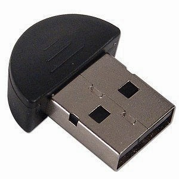
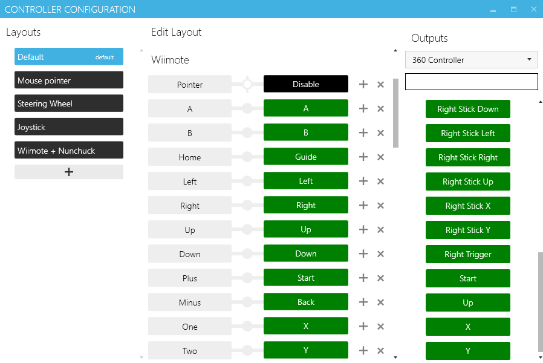
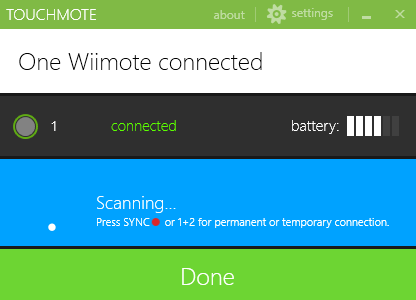
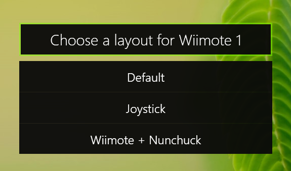
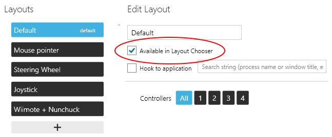
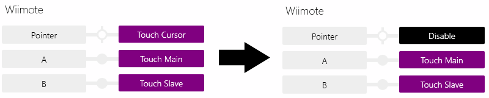

Para aquellos que tenemos una _Wii_ cogiendo polvo dentro del armario, hay que saber que es posible utilizar su mando para jugar en el _PC_ con _Windows 8_ utilizando una aplicación _todo en uno_ llamada _Touchmote_.

Lo que vamos a necesitar es:

- Un adaptador _Bluetooth USB_
- La aplicación _[Touchmote](http://www.touchmote.net/)_

Lo primero que hay que tener en cuenta es que no todos los adaptadores _Bluetooth_ son compatibles con el mando de _Wii_. En mi caso he tenido éxito con un adaptador _Bluetooth_ de los chinos sin necesidad de instalar drivers. Existe una lista de compatibilidad que puede consultarse [aquí](http://wiibrew.org/wiki/List_of_Working_Bluetooth_Devices).

Lo primero es instalar la aplicación _Touchmote_. Dicha aplicación se encarga de gestionar la conexión del mando y las distintas configuraciones, haciendo que el mando de _Wiimote_ sea reconocido por el ordenador como un **mando de _Xbox 360_**, lo que hace que funcione automáticamente en la mayoría de juegos modernos.

<table class="tr-caption-container" style="margin-left: auto; margin-right: auto; text-align: center;" cellspacing="0" cellpadding="0" align="center"><tbody><tr><td style="text-align: center;"></td></tr><tr><td class="tr-caption" style="text-align: center;">Wiimote configurado para emular los botones del mando de <i>Xbox 360</i></td></tr></tbody></table>

Una vez instalado lo ejecutamos desde el acceso directo que ha creado en el escritorio. Nos pedirá permisos de administrador cada vez que lo ejecutemos, a lo que diremos que sí.

Nos aparecerá la siguiente pantalla:

<table class="tr-caption-container" style="margin-left: auto; margin-right: auto; text-align: center;" cellspacing="0" cellpadding="0" align="center"><tbody><tr><td style="text-align: center;"></td></tr><tr><td class="tr-caption" style="text-align: center;">Ventana principal de Touchmote</td></tr></tbody></table>

Una vez pulsemos el enorme botón azul de _"Pair Wiimotes"_ comenzará a buscar dispositivos.

Es entonces cuando en el mando de _Wii_ tendremos que pulsar en botón de sincronización rojo que se encuentra en la parte trasera del mando retirando la tapa de las pilas si queremos una sincronización **permanente** o pulsando simultáneamente los botones **1 y 2** si queremos una sincronización **temporal**.

Si todo va bien aparecerá un mensaje indicando que se ha encontrado un _Wiimote_. Le damos a _"Back"_ para terminar el proceso de búsqueda y ya está todo listo.

 

<table class="tr-caption-container" style="margin-left: auto; margin-right: auto; text-align: center;" cellspacing="0" cellpadding="0" align="center"><tbody><tr><td style="text-align: center;"></td></tr><tr><td class="tr-caption" style="text-align: center;">Ya tenemos un mando sincronizado</td></tr></tbody></table>

 

Se pueden utilizar varias configuraciones de mando o crear las nuestras propias, que podemos seleccionar desde el menú que aparece al pulsar el botón _"Home"_ unos segundos.

 

<table class="tr-caption-container" style="margin-left: auto; margin-right: auto; text-align: center;" cellspacing="0" cellpadding="0" align="center"><tbody><tr><td style="text-align: center;"></td></tr><tr><td class="tr-caption" style="text-align: center;">Menú que aparece al dejar pulsado el botón "Home"</td></tr></tbody></table>

 

Es importante tener en cuenta una pega de la versión actual de _Touchmote_. El menú de selección sólo permite seleccionar entre las tres primeras configuraciones que tengan activada la casilla de selección "Available in layout chooser".

 

<table class="tr-caption-container" style="margin-left: auto; margin-right: auto; text-align: center;" cellspacing="0" cellpadding="0" align="center"><tbody><tr><td style="text-align: center;"></td></tr><tr><td class="tr-caption" style="text-align: center;">Opción para que la entrada esté disponible en el menú rápido</td></tr></tbody></table>

Otra problema es que si no tenemos una barra de sensores inalámbrica no podremos utilizar el mando para mover el cursor, lo que nos privará de uno de los analógicos. Si se quiere probar el funcionamiento, se puede conectar la _Wii_ para alimentar la barra de sensores que viene con la consola, pero como no querremos tener encendida la consola cada vez que queramos usar el mando (yo al menos no) iremos a la configuración de botones y dejaremos "Pointer" en "Disable" para desactivar la opción de señalar con el mando.

 

<table class="tr-caption-container" style="margin-left: auto; margin-right: auto; text-align: center;" cellspacing="0" cellpadding="0" align="center"><tbody><tr><td style="text-align: center;"></td></tr><tr><td class="tr-caption" style="text-align: center;">Si no disponemos de barra de sensores desactivaremos el puntero</td></tr></tbody></table>

 

Ahora que lo tenemos todo configurado, sólo queda probar algunos juegos. Personalmente lo utilizo en modo horizontal para jugar a emuladores de _[NES](http://sourceforge.net/projects/nester-emu/)_ y _[GameBoy](http://vba-m.com/)_ por la sensación de **autenticidad** que proporciona.

Señalar que según [su página](http://www.touchmote.net/) Touchmote también funciona en _Windows 7_.
