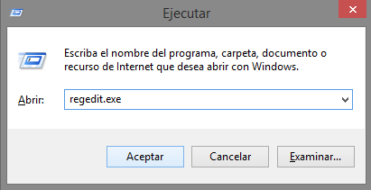
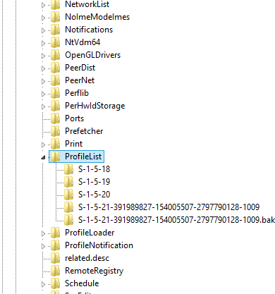
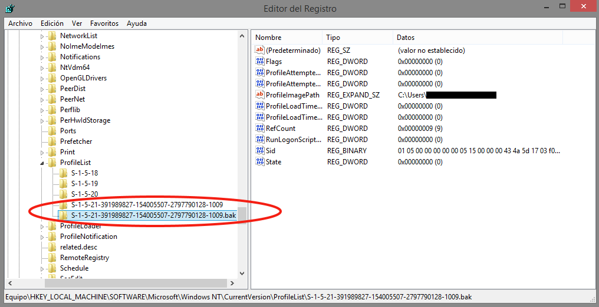
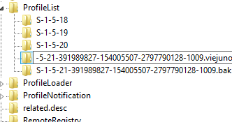
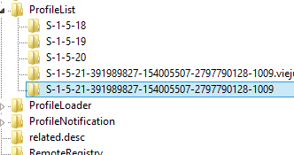

Un **perfil de usuario** es una colección de preferencias personales que puede contener fondos de escritorio, la disposición de los iconos o la configuración de colores, entre otras cosas. Y en ocasiones se **corrompe**.

Cuando esto pasa, nos encontramos con un escritorio vacío "que no es el nuestro" (que en realidad es un perfil temporal), en el mejor de los casos, o un mensaje de "Error en el inicio de sesión del servicio de perfil de usuario" en el peor.

Perder el acceso al perfil de Windows es algo más habitual de lo que parece, pero tiene **solución**.

Antes de ponernos a crear un nuevo perfil de usuario y a mover todos los datos, existe algo que podemos comprobar de forma rápida en el registro de Windows:

1. Abrimos el **editor de registro** (si no lo encontramos, podemos pulsar la tecla Windows + R, escribir regedit.exe y pulsar en aceptar):
    
    <table class="tr-caption-container" style="margin-left: auto; margin-right: auto; text-align: center;" cellspacing="0" cellpadding="0" align="center"><tbody><tr><td style="text-align: center;"></td></tr><tr><td class="tr-caption" style="text-align: center;">Abrimos el editor de registro.</td></tr></tbody></table>
    
      
2. Nos vamos a HKEY\_LOCAL\_MACHINESOFTWAREMicrosoftWindows NTCurrentVersionProfileList
    
    <table class="tr-caption-container" style="margin-left: auto; margin-right: auto; text-align: center;" cellspacing="0" cellpadding="0" align="center"><tbody><tr><td style="text-align: center;"></td></tr><tr><td class="tr-caption" style="text-align: center;">Lista de perfiles. Vemos que hay dos que se llaman casi igual.</td></tr></tbody></table>
    
     
3. Miramos los perfiles de usuario que hay dentro. Probablemente haya dos con el mismo nombre y que empiezan por S-1-5, pero uno de ellos **terminado en .bak**. Este último debería contener la ruta de usuario correcta en la clave ProfileImagePath, así podrás asegurarte de que es lo que buscas.
    
    <table class="tr-caption-container" style="margin-left: auto; margin-right: auto; text-align: center;" cellspacing="0" cellpadding="0" align="center"><tbody><tr><td style="text-align: center;"></td></tr><tr><td class="tr-caption" style="text-align: center;">Comprobamos que es el perfil que estamos buscando.</td></tr></tbody></table>
    
     
4. **Renombra** el perfil que no tiene extensión .bak (por ejemplo, puedes añadir la extensión .viejo):
    
    <table class="tr-caption-container" style="margin-left: auto; margin-right: auto; text-align: center;" cellspacing="0" cellpadding="0" align="center"><tbody><tr><td style="text-align: center;"></td></tr><tr><td class="tr-caption" style="text-align: center;">Renombramos el perfil sin extensión.</td></tr></tbody></table>
    
     
5. **Quita** la extensión .bak al otro perfil:
    
    <table class="tr-caption-container" style="margin-left: auto; margin-right: auto; text-align: center;" cellspacing="0" cellpadding="0" align="center"><tbody><tr><td style="text-align: center;"></td></tr><tr><td class="tr-caption" style="text-align: center;">Eliminamos la extensión del otro perfil.</td></tr></tbody></table>
    
     
6. **Reinicia** y pruebra a ver si el perfil carga correctamente
