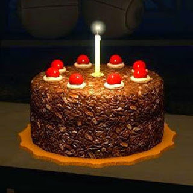

Queda ya lejos aquel _29 de Diciembre de 1999_ en el que _[Shenmue](http://es.wikipedia.org/wiki/Shenmue)_ fue lanzado en el territorio japonés para la consola _[Dreamcast](http://es.wikipedia.org/wiki/Sega_Dreamcast)_ de [Sega](http://es.wikipedia.org/wiki/Sega). Un título que cuenta con la capacidad de polarizar al público, generando odios y pasiones como sólo una obra maestra es capaz de hacer. La _magnum opus_ **inacabada** de _[Yu Suzuki](http://es.wikipedia.org/wiki/Y%C5%AB_Suzuki)_.

Para aquellos que lo jugaron no es necesario alabar **las bondades** de este juego y su secuela, en realidad estaban pensadas como un sólo título. Conocen el **amor al detalle** que rezuma Shenmue por todos sus poros. Saben del **salto gráfico** que supuso el juego para el año en que salió. Seguro que son conscientes del increíble trabajo de **documentación** del que el equipo [Sega AM2](http://es.wikipedia.org/wiki/Sega-AM2) hizo gala, como puede verse en [esta comparativa](http://yokosuka-shenmue.webcindario.com/) entre el juego y el mundo real.

Y por supuesto, cualquiera que lo haya jugado conocerá **el dolor y la frustración** que produce ser partícipe de gran historia, acompañar al protagonista en su epopeya, empaparse del ambiente del juego y contemplar cómo evoluciona la personalidad de Ryo para que, al final del viaje, nos quedemos con un _cliffhanger_ que nos deja sin posibilidad alguna de conocer cómo terminan las aventuras del bueno de Ryo.

De hecho, si por algo ha llegado a destacar _Shenmue_ en todos estos años, ha sido por los **[constantes rumores](http://lmgtfy.com/?q=rumores+shenmue+3)** sobre una tercera parte que han aparecido por toda la red. Los fans del juego, que conmovedoramente nunca pierden la **esperanza**, ven señales de la secuela en cualquier cosa que haga o diga su creador. Ven señales de _Shenmue 3_ incluso en los posos del _Cola-Cao_. _(Nota: yo me cuento entre ellos)._

Hablando ahora en serio, las teorías sobre la tercera parte del juego empiezan a alcanzar el estátus de leyenda en la cultura gamer, casi al nivel de [E.T. y los cartuchos enterrados](http://es.wikipedia.org/wiki/Entierro_de_videojuegos_de_Atari), ([supuestamente desmitificada](http://www.meristation.com/pc/noticias/los-cartuchos-de-e-t--desenterrados-30-anos-despues/58/1869618) y [deliciosamente parodiada](http://www.imdb.com/title/tt2123146/) en Angry Videogame Nerd: The Movie) o [Duke Nukem Forever](http://es.wikipedia.org/wiki/Duke_Nukem_Forever) (que en contra de todo pronóstico fue lanzado al mercado). **Y eso es algo que está al alcance de muy pocos.**

En cualquier caso: _¡Feliz 15º Aniversario, Shenmue!_

<table class="tr-caption-container" style="margin-left: auto; margin-right: auto; text-align: center;" cellspacing="0" cellpadding="0" align="center"><tbody><tr><td style="text-align: center;"></td></tr><tr><td class="tr-caption" style="text-align: center;"><i>The cake is a lie</i></td></tr></tbody></table>
